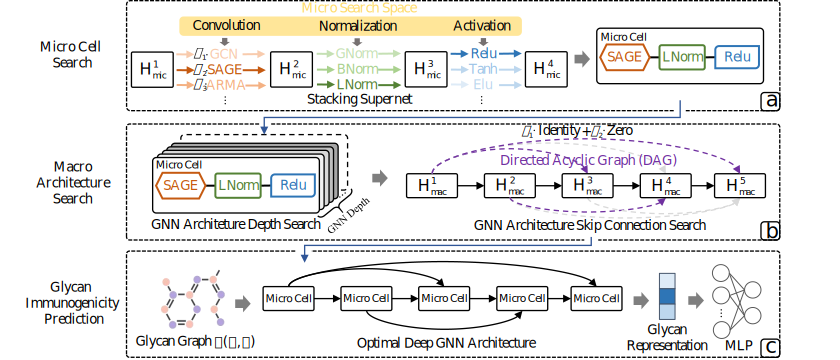

# AutoDM<sup>2</sup>

- AutoDM<sup>2</sup> can design a deep GNN architecture for glycan molecular graph representaion learning.

- The framework of AutoDM<sup>2</sup> is as follows:

<br>
<div align=left>  </div>


## Install based on Ubuntu 16.04

- **Ensure you have installed CUDA 11.1 before installing other packages**

**1.Python environment:** recommending using Conda package manager to install

```python
conda create -n autodm2 python=3.7
source activate autodm2
```

**2.Python package:**
```python
torch == 1.8.2
torch-geometric == 2.0.2
torch-scatter == 2.0.7
torch-sparse == 0.6.11
hyperopt == 0.1.2
```
## Run the Experiment
**1.Performance test with the optimal deep GNN architecture designed by AutoDM<sup>2</sup>**
```python
run main_test.py
```

**2.Search new deep GNN architecture using AutoDM<sup>2</sup>**
```python
run main_search.py
```
